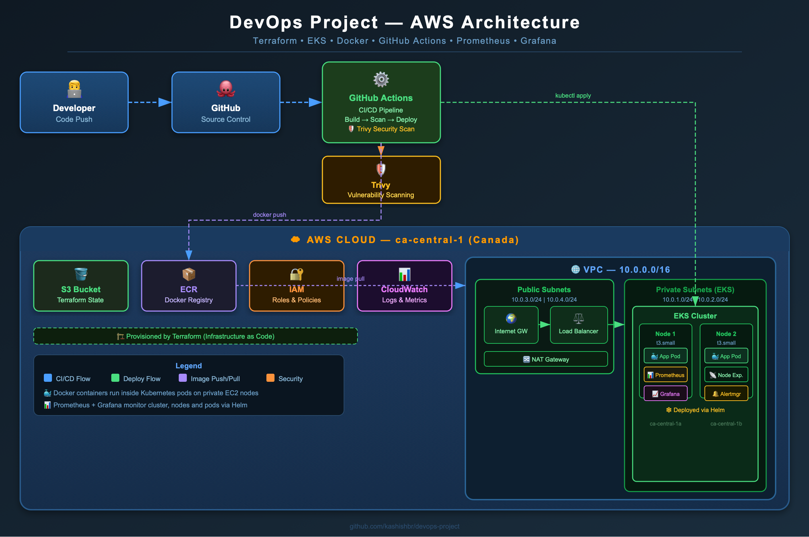
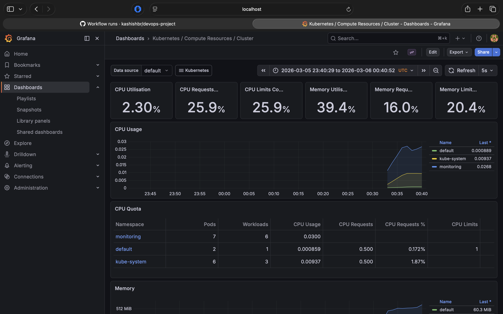
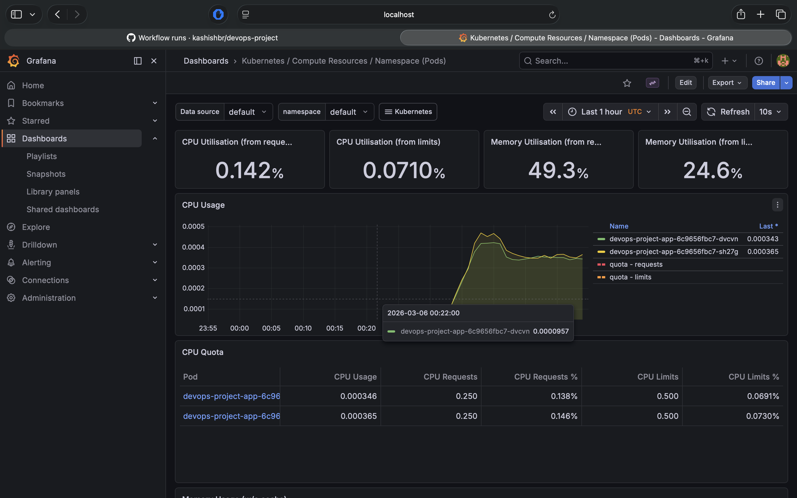
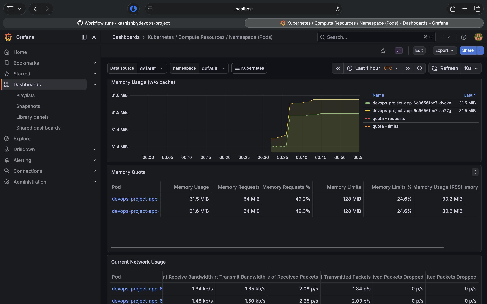
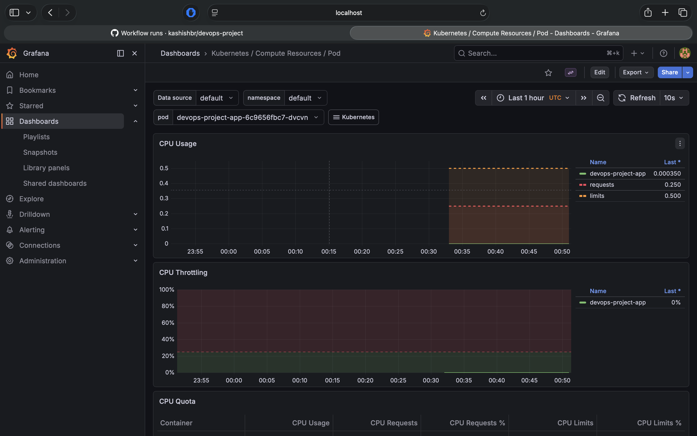
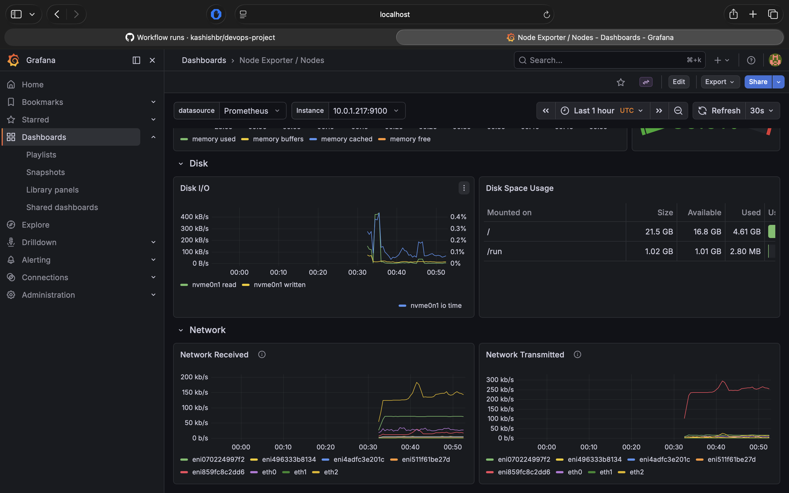
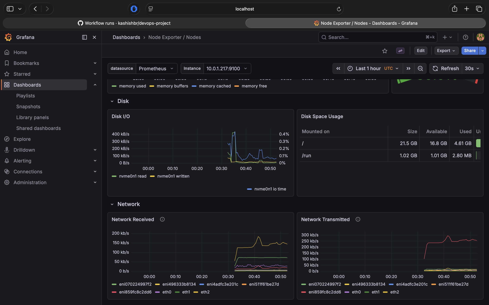

# DevOps Project — End-to-End CI/CD Pipeline on AWS

A production-grade DevOps project demonstrating a complete CI/CD pipeline with infrastructure as code, container orchestration, and monitoring.

## 🏗️ Architecture



## 🛠️ Tech Stack

| Tool | Purpose |
|---|---|
| Terraform | Infrastructure as Code |
| AWS EKS | Kubernetes cluster |
| AWS ECR | Docker image registry |
| AWS VPC | Private network |
| Docker | Containerization |
| Kubernetes | Container orchestration |
| GitHub Actions | CI/CD pipeline |
| Trivy | Security scanning |
| Prometheus | Metrics collection |
| Grafana | Monitoring dashboards |
| Python/Bash | Automation scripts |

## 🚀 Pipeline Flow
```
Code Push to GitHub
        ↓
GitHub Actions triggered
        ↓
Docker image built (AMD64)
        ↓
Trivy security scan
        ↓
Image pushed to ECR
        ↓
Deployed to EKS
        ↓
Automatic rollback if failed
```

## ☁️ AWS Infrastructure

Built with Terraform:
- VPC with public and private subnets across 2 availability zones
- EKS cluster with managed node groups
- ECR repository with vulnerability scanning
- S3 remote state management
- NAT Gateway for private subnet internet access

## 📊 Monitoring




- Prometheus scrapes metrics from all pods and nodes
- Grafana dashboards for cluster, node and pod monitoring
- CPU usage alerts configured
- Node Exporter for EC2 metrics

## 🔒 Security

- IAM roles with least privilege
- Private subnets for Kubernetes nodes
- Trivy vulnerability scanning on every deployment
- ECR image scanning on push
- Kubernetes resource limits on all pods
- Remote Terraform state in S3

## 🤖 Automation

`scripts/ecr-cleanup.py` — automatically cleans up old ECR images keeping only the 5 most recent to manage storage costs.

## 📁 Project Structure
```
devops-project/
├── terraform/          # AWS infrastructure
│   ├── main.tf
│   ├── variables.tf
│   ├── outputs.tf
│   └── providers.tf
├── app/                # Flask application
│   ├── app.py
│   ├── requirements.txt
│   └── Dockerfile
├── k8s/                # Kubernetes manifests
│   ├── deployment.yml
│   └── service.yml
├── .github/
│   └── workflows/
│       └── deploy.yml  # CI/CD pipeline
└── scripts/
    └── ecr-cleanup.py  # Automation script
```

## 🏃 How to Run

### Prerequisites
- AWS CLI configured
- Terraform installed
- kubectl installed
- Helm installed
- Docker installed

### Deploy Infrastructure
```bash
cd terraform
terraform init
terraform apply
```

### Connect to Cluster
```bash
aws eks update-kubeconfig --region ca-central-1 --name devops-project-cluster
kubectl get nodes
```

### Deploy App
```bash
kubectl apply -f k8s/deployment.yml
kubectl apply -f k8s/service.yml
```

### Install Monitoring
```bash
helm repo add prometheus-community https://prometheus-community.github.io/helm-charts
helm install monitoring prometheus-community/kube-prometheus-stack --namespace monitoring --create-namespace
```

### Run Automation Script
```bash
pip3 install boto3
python3 scripts/ecr-cleanup.py
```

### Destroy Infrastructure
```bash
kubectl delete service devops-project-service
terraform destroy
```

## 📸 Screenshots

## Cluster Overview


### Namespace Pod Resources


### Namespace Memory Usage


### Pod Level Metrics


### Node Disk Metrics


### Node Network Metrics
